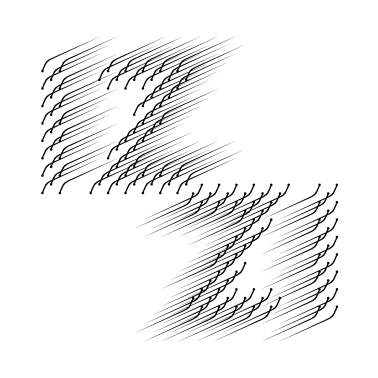

# Examples

- ## sources [c++](https://github.com/bdekoz/izzi/tree/main/examples)
- ## as rendered svg
  - [iframe-1](../examples/iframe-1.svg)
  - [iframe-2](../examples/iframe-2.svg)
  - [image-1](../examples/image-1.svg)
  - [image-2](../examples/image-2.svg)
  - [video-1](../examples/video-1.svg)
  - [video-2](../examples/video-2.svg)
  - [link-1](../examples/link-1.svg)
  - [link-2](../examples/link-2.svg)
  - [link-3](../examples/link-3.svg)
  - [link-41](../examples/link-4.1.svg)
  - [link-42](../examples/link-4.2.svg)		
  - [link-5](../examples/link-5.svg)  
  - [object-1](../examples/object-1.svg)
  - [rect title](../examples/rectangle-title.svg)
  - [circle title](../examples/circle-title.svg)    

